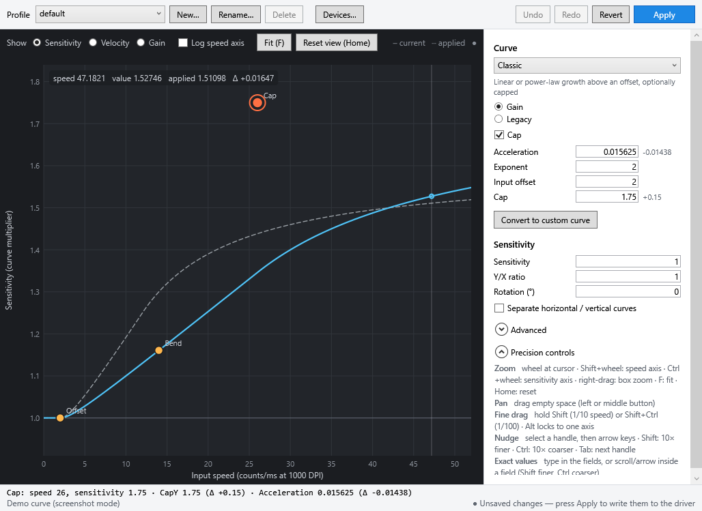

# Curve Editor (`rawaccel-editor.exe`)

The curve editor is an alternative to the Raw Accel GUI. Instead of typing coefficients, you shape the acceleration curve by dragging handles on the chart. It reads and writes the same `settings.json` as `rawaccel.exe` and `writer.exe`, so you can switch between the tools freely.

Put `rawaccel-editor.exe` and `curve-editor-core.dll` in the Raw Accel folder, next to `wrapper.dll` and `settings.json`, then run it. Nothing reaches the driver until you press **Apply** (Ctrl+S). Apply validates the settings, writes `settings.json`, and sends them to the driver.

## The chart

- **Solid line:** the curve you are editing.
- **Dashed line:** the last applied settings. Compare the two while you make changes.
- **Green dot:** your mouse as you move it, placed on the applied curve.
- **Speed axis:** counts/ms at 1000 DPI, which is the same unit the driver and the old GUI use. If a device has a DPI set under **Devices…**, speed is normalized to inches per second.
- **Views:** switch between *Sensitivity*, *Velocity* and *Gain* at the top. Handles are shown in the Sensitivity view.
- **Readout:** hovering shows the speed, the current value, the applied value and the difference (Δ).

## Handles per mode

| Mode | Handles |
|---|---|
| Classic | **Offset** (where acceleration starts). **Cap** (where the cap takes effect and its level; turn off *Cap* for an uncapped curve, which gets an **Accel** handle instead). **Bend** (exponent). |
| Power | **Start** (output offset). **Cap**, or **Scale** when uncapped. **Bend** (exponent). |
| Natural | **Offset**. **Decay** (drag left to reach the limit sooner). **Limit** (dashed level line; grab it anywhere along the line). |
| Jump | **Jump** (speed and sensitivity after the step). **Smooth** (width of the transition). |
| Synchronous | **Sync** (centre speed). **Gamma** (transition speed). **Smooth**. **Motivity** (level line). A log speed axis is turned on for this mode. |
| Custom curve | Free-form points. Double-click empty space to add a point, drag to move, right-click or Delete to remove. |

Classic and power curves are saved using the `output` cap mode. Curves loaded with `in_out` or `input` cap modes are converted when loaded, and the converted curve is identical to the original.

**Convert to custom curve** turns any curve into free-form points that start on the same shape.

## Precision controls

| To… | Do this |
|---|---|
| Zoom | Mouse wheel at the cursor. Shift+wheel zooms only the speed axis, Ctrl+wheel only the sensitivity axis. Right-drag draws a box to zoom into. `+`/`-` zoom around the centre. |
| Pan | Drag empty space with the left or middle button. |
| Fit / reset | **F** fits the sensitivity range to the visible curve. **Home** resets the view. |
| Fine drag | Hold **Shift** for 1/10 of the mouse movement, or **Shift+Ctrl** for 1/100. Drags are relative, so grabbing a handle never makes it jump. You can press or release the modifiers mid-drag. |
| Lock an axis | Hold **Alt** while dragging. |
| Nudge | Click a handle, then use the arrow keys. One press moves 1/200 of the visible range, so zooming in makes the steps smaller. Shift makes it 10× finer, Ctrl 10× coarser. **Tab** selects the next handle. The status bar shows the exact step size. |
| Exact values | Type into a field and press Enter. With a field focused, the mouse wheel or Up/Down steps the third significant digit (Shift finer, Ctrl coarser). |
| Undo | Ctrl+Z / Ctrl+Y. A burst of arrow-key nudges on the same handle counts as one undo step. **Revert** returns to the last applied settings. |

The status bar shows the selected handle's position, the parameters it changes, and how far each has moved since the last Apply.

## Custom curves

- **Two ways to join the points:** with *Smooth curve through points* on, the editor draws an overshoot-free spline through your points and samples it into the driver's table (at most 257 entries, and up to 64 points while smoothing). With it off, the points are joined by straight lines.
- **Gain or legacy:** *Points are output speed (gain)* interpolates velocity, which is the gain-style behaviour. The legacy option interpolates sensitivity directly. Either way, you edit the points as sensitivity.
- **Past the last point:** the driver keeps following the slope of the last segment. Put your last point beyond the fastest speed you care about.
- **Text box:** points can be pasted or edited as `speed,sensitivity;speed,sensitivity;…`.
- **Saved points:** your editable points and the smoothing choice are saved in `curve-editor.json`, because `settings.json` only stores the sampled table. If `settings.json` is changed by another tool, the editor loads the table's points as-is.

## Profiles and devices

- **Profiles:** every profile in `settings.json` can be edited. Use the selector at the top to switch, and **New…**, **Rename…** and **Delete** to manage them. Renaming a profile updates any devices assigned to it.
- **Devices:** **Devices…** sets the default DPI, polling rate and disable state. For each device, tick *Override* to give it its own values and profile. Devices without a profile use the first profile.

## For developers

- **`curve-editor-core/`:** platform-independent curve math (a port of `common/accel-*.hpp`), handles, splines and view/interaction math.
  - Tests: `dotnet test curve-editor-core-tests`. These run on any OS.
  - Among them, `NativeReference/gen.cpp` compiles the driver's accel headers to produce the reference values the port is checked against. Rebuild it when the accel code changes.
- **`curve-editor/`:** the WPF app (.NET Framework 4.7.2). It references the C++/CLI `wrapper`.
- **`wrapper-tests/CurveEditorParityTests.cs`:** checks the editor's preview against `ManagedAccel`.
- **Screenshot mode:** `rawaccel-editor.exe --screenshot out.png` renders the window with a demo curve and exits. It does not use the driver.
- **CI:** `.github/workflows/curve-editor.yml` builds and tests everything on Windows.
